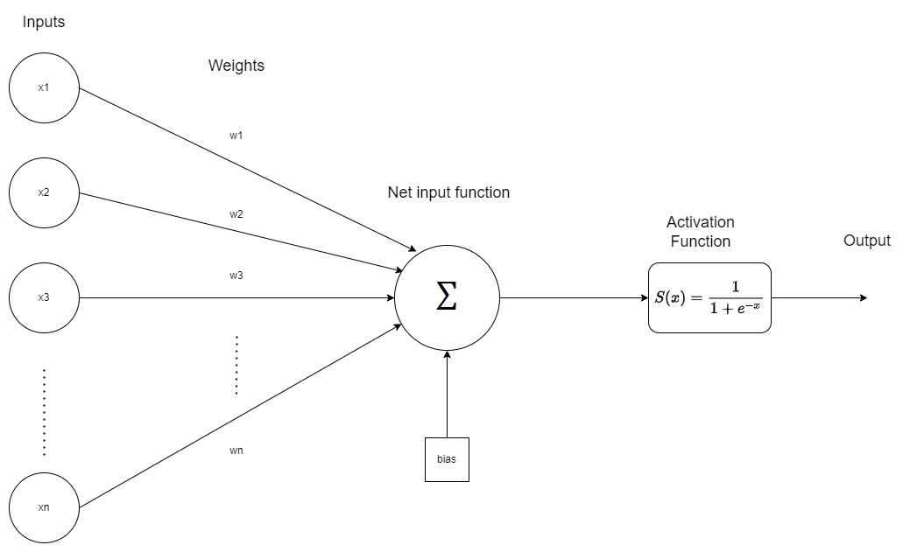
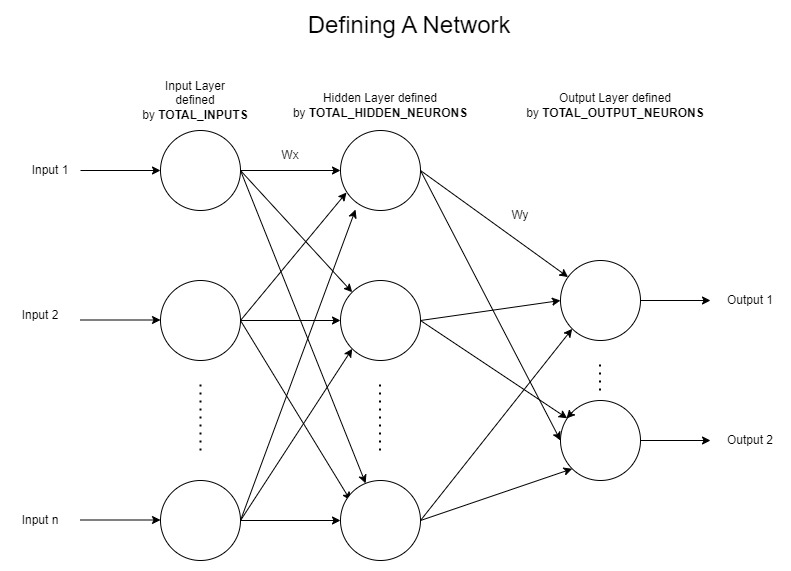
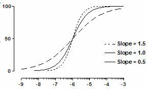
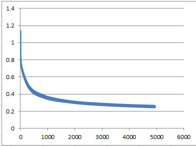

# dsPIC33 Neural Network with back propagation learning

A neural network is a logical circuit or a network of artificial neurons. These network can have ability to adjust weights during the process called learning techniques. There are several learning techniques to train a neural network (in this example we have demonstrated Back Propagation Technique). These network once trained can be utilized to solve problems related to patterns, or to develop methamatical model that leads to desired set of outputs for given set of inputs.

Following is a single neuron with n inputs towards it and one output.  

A network can be formed by connecting output of one neuron to input of another neuron. 
Following is an example on how to configure a network in this project containing 3 layers by modifying values in `neural_network_config.h` (Input Layer, Hidden Layer and Output Layer)

<b>This code comes with demo to train the network in order to perform `XOR` operation.</b>

## Configuration

### neural_network_config.h

- `TOTAL_INPUTS` - To change number of neurons in input layer.

- `TOTAL_HIDDEN_NEURONS` - To change number of neurons in hidden layer.

- `TOTAL_OUTPUT_NEURONS` - To change number of neurons in output layer.

- `SIGMOID_EXP_CONSTANT` - Slope factor of the sigmoid function (Usually kept to 1) 
  

- `ENABLE_LEARNING` - Set to 1 for enable learning process API access.

- `LEARNING_RATE` - Defines the momentum (fastness) of learning. More learning rate has faster convergence but leads to less accurate outputs. Low learning rate will have slower learning but much accurate outputs.

- `EPOCH_SIZE` - Number of unique training samples

- `ENABLE_BIAS_ADJUST` - Update bias along with weights.

### trainingData.c/.h

- This file contains the training set for `XOR` and is compleatly application specific. It can be updated to required input pattern and output sets.

- **Fun Exercise: Update this file to training sets of NAND operation, and run the program.**

## Usage (XOR demo is implemented in main.c for reference)

1. Configure `EPOCH_REPEAT`, to perform number of learning. (This is application defined macro, usually more repeat training leads to accurate outputs). Following is the sample of error converging towards zero at around 5000 repeat training 
   
2. `Randomize_Weights()` and `Randomize_Bias()` APIs has to be called to initialize network with random weights.
3. Initialize training sets. (`trainingDataSet()` in this demo is application API)
4. Start learning process by calling `Learning_Process_Start()`.
5. Repeat `Learning_Process_Start()` until `currentLearningState` is not equal to `EPOCH_COMPLETE`.
6. Perform the step 5 until number of times the learning is required. (configured by `EPOCH_REPEAT`)
7. Once training is complete update inputs and call `Feed_Forward_Start()` API. The outputs can be obtained from `outputNeuron[i].activatedOutput`, where i is the index of output neuron.
